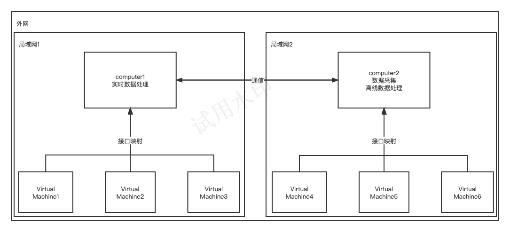
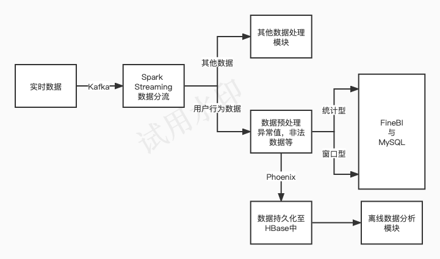

# TianMaoLogAnalyst

## 需求：

（1）数据经过预处理后持久化至HBase中   
（2）实时更新用户对商家与品牌数量至MySQL中  
（3）最高成交量的15s

## 组件:

（1）Hadoop-3.3.1：搭配HBase与checkpoint使用  
（2）Kafka-3.4.0：消息队列  
（3）Spark-Streaming-3.3.2：计算框架，需求实现  
（4）HBase-2.4.16，MySQL8：数据持久化

## 集群:

共有两台计算机：Computer1负责实时数据分析与数据持久化，Computer2负责模拟数据采集与离线数据分析。  
因此，组件分布如下：Hadoop、HBase、Spark与MySQL部署在Computer1上，Hive、Flume部署在Compute
r2上。
两台计算机在同一网络环境下通过SSH远程通信，访问MySQl与HDFS数据。

## 实时处理模块

